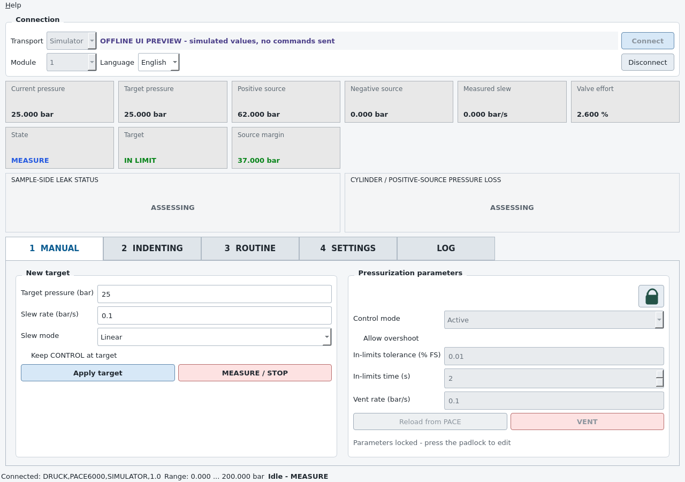

# PACE Controller

[](https://github.com/SebRoLENS/pace-controller/releases/latest)
[](https://github.com/SebRoLENS/pace-controller/releases/latest)
[](https://github.com/SebRoLENS/pace-controller/releases/latest)
[](LICENSE)

Cross-platform graphical controller for classic Druck **PACE 5000** and **PACE 6000** instruments using Ethernet or RS-232.

Current public version: **1.0.1**

> [!CAUTION]
> This application sends real pressure-control and vent commands. It is not a certified safety system and does not replace pressure-relief devices, hardware interlocks, instrument limits, laboratory procedures, or direct operator supervision.

## Download

**[Download the latest release](https://github.com/SebRoLENS/pace-controller/releases/latest)**

- standalone Windows x86-64 executable;
- standalone Linux x86-64 archive;
- complete offline source package;
- versioned PDF manual and SHA-256 checksums.

The binaries are unsigned, so Windows SmartScreen or local Linux security policy may request confirmation. Source code and reproducible build automation are public.

## Interface



The screenshot is generated automatically by the real PySide6 GUI in offline simulator mode. No instrument command is sent while producing it.

## Connections

| Connection | Windows | Linux | Runtime driver |
|---|---:|---:|---|
| Ethernet TCP/SCPI | Yes | Yes | None |
| Native RS-232 | Yes | Yes | OS serial driver |
| USB-to-RS-232 | Yes | Yes | Converter driver only |
| Offline simulator | Yes | Yes | None |

No NI-VISA, Druck USB driver, Python, LabVIEW, or Internet connection is required by the packaged application.

## Highlights

- English by default, with persistent Italian selection.
- Nine telemetry cards visible together on two rows, with three-decimal display.
- Manual targets, selectable slew, CONTROL/MEASURE behaviour, and protected advanced parameters.
- Indenting cycle and editable multi-step JSON routines.
- Permanent sample-side and inlet-side loss indicators with configurable thresholds.
- Source-margin interlock: CONTROL stops below 2.0 bar margin and rearms at 2.2 bar.
- Confirmation for target increases of at least 10 bar and slew above 0.5 bar/s.
- Automatic MEASURE attempt on required-telemetry loss during CONTROL.
- Full-precision CSV telemetry and diagnostic logs.
- Hardware-free simulator and automated screenshot tests.

## PACE configuration

### Ethernet

Use static address `192.168.10.2`, mask `255.255.255.0`, empty gateway/DNS, Access Control **Open**, and TCP SCPI port `5025`.

Ethernet commands are sent with CRLF line endings: the final LF is the SCPI
message terminator required by the Druck K0472 manual and matches the validated
legacy Windows implementation.

The application first tries the configured address. If enabled, it temporarily adds `192.168.10.1/24` only to exactly one safe dedicated adapter with no gateway or unrelated network. Ambiguous adapters are never modified.

### RS-232

Start with `9600` baud, 8 data bits, no parity, 1 stop bit, no flow control, SCPI protocol, and CR terminator. The GUI also supports every documented PACE baud rate from 2400 to 115200, Even/Odd parity, XON/XOFF, and RTS/CTS.

On Linux, serial access may require membership in the `dialout` group.

## Documentation

- [Cross-platform README](cross_platform/README.md)
- [Detailed Markdown manual](cross_platform/docs/PACE_Controller_Manual.md)
- PDF manual in every release
- [Example routine](cross_platform/examples/routine_example.json)
- [Official Druck SCPI manual K0472](https://druck.com/wp-content/uploads/2026/05/K0472-PACE-SCPI-Remote-Communications-Manual-EN.pdf)

## Source layout

- `cross_platform/`: current Python/PySide6 application for Windows and Linux;
- `PACE_Controller.ps1`: unchanged legacy PowerShell/WinForms v0.3.1;
- `.github/workflows/`: validation, screenshot, packaging, and automatic release pipelines.

The cross-platform pipeline builds and publishes both operating-system packages automatically from a validated tag. Local reproducible build scripts are available in `cross_platform/scripts/`.

The v0.3.1 implementation remains permanently available from its immutable tag and release. The cross-platform rewrite does not modify it.

## Development

```bash
cd cross_platform
python -m venv .venv
source .venv/bin/activate
python -m pip install -r requirements-dev.txt
python -m pace_controller --simulate
python -m pytest
```

## License and independence

MIT License. See [LICENSE](LICENSE).

PACE Controller is independent open-source software and is not an official Druck or Baker Hughes product. Development used AI-assisted programming. Validate every workflow at low pressure on a safe, unloaded setup before operational use.
