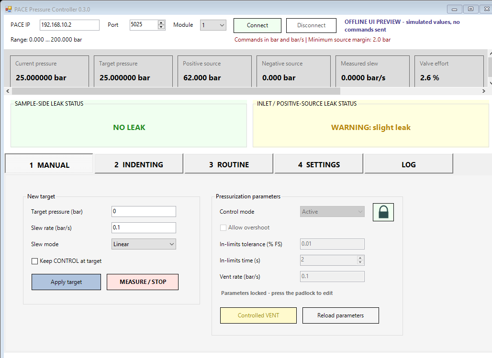

# PACE Controller

**PACE Controller** is a lightweight graphical controller for classic Druck PACE 5000 and PACE 6000 instruments connected directly to an offline Windows PC through Ethernet.

It reads pressure and source telemetry, controls target pressure and slew rate, runs programmable pressure routines, and provides software safety checks. No NI-VISA, Druck USB driver, Python, LabVIEW, or Internet connection is required at run time.

> [!CAUTION]
> This application sends real pressure-control commands. It is not a certified safety system and does not replace pressure relief devices, hardware interlocks, instrument limits, laboratory procedures, or direct operator supervision.

## Interface

The two leak indicators remain visible on every operating page. This is a real WinForms rendering generated automatically from the current application source in offline screenshot mode. The displayed values are simulated and no commands are sent to an instrument.

## Download

**[Download the latest Windows release](https://github.com/SebRoLENS/pace-controller/releases/latest)**

Release assets include:

- `PACE-Controller-vX.Y.Z-Windows-x86_64.exe`: standalone unsigned Windows executable;
- `PACE-Controller-vX.Y.Z-source.zip`: PowerShell source, launcher, example routine, documentation, and license;
- `PACE_Controller_Manual.pdf`: versioned manual;
- `SHA256SUMS.txt`: integrity checksums.

Windows SmartScreen may warn because the executable is not code-signed. The complete source and reproducible GitHub Actions build workflow are available in this repository.

## Instrument configuration

Recommended PACE Ethernet settings:

| Parameter | Value |
| --- | --- |
| Address mode | `STATIC` |
| PACE address | `192.168.10.2` |
| Subnet mask | `255.255.255.0` |
| Gateway | empty or `0.0.0.0` |
| Access control | `OPEN` |
| SCPI socket | TCP `5025` |

At startup the application identifies the single safe, dedicated Ethernet adapter and temporarily adds `192.168.10.1/24`. Adapters with a gateway or an address on another network are not modified. The previous configuration is restored when the program closes.

## Main features

- Live display of current pressure, target, positive and negative source pressure, measured slew, valve effort, CONTROL/MEASURE state, in-limits state, and source margin. All nine telemetry cards are visible together on two rows; numeric values use three decimal places.
- Manual target with linear or maximum slew rate.
- Active, Passive, or Gauge control mode; overshoot, in-limits tolerance/time, and controlled vent settings.
- Pressurization parameters are read-only by default. Editing requires pressing the padlock and explicitly confirming a danger-area warning.
- Optional **Keep CONTROL at target**; disabled by default.
- **Indenting** cycle: reach target, dwell for 120 s, return to zero at the same slew, then switch to MEASURE.
- Editable multi-step routines with independent target, slew, and dwell values; JSON save/load.
- Automatic CSV telemetry and diagnostic logging.
- Prominent sample-side and positive-inlet leak indicators.
- User-adjustable and persistent leak thresholds.
- Complete English interface by default, with Italian selectable from the language menu. The choice is saved between sessions.

## Software protections

- Confirmation for upward target changes of at least 10 bar.
- Confirmation when slew exceeds 0.5 bar/s or Maximum mode is selected.
- Targets outside the PACE module range are rejected.
- Targets that would leave less than 2.0 bar between positive source and current pressure are rejected.
- During CONTROL, if `positive source pressure - current pressure < 2.0 bar`, any manual action, indenting cycle, or routine is cancelled and MEASURE is requested.
- After a source-margin intervention, CONTROL remains blocked until the margin reaches 2.2 bar.
- Loss of required source telemetry during CONTROL triggers a fail-safe attempt to request MEASURE.
- Automation timeout requests MEASURE if the target is not reached in the allowed time.

Software checks depend on communication with the PACE and normally run once per second. A communication failure can prevent confirmation of MEASURE; always keep the front panel and hardware pressure protections accessible.

## Leak monitoring

Leak monitoring is performed separately for:

- the sample side, using current controlled pressure;
- the inlet side, using positive source pressure (`COMP1`).

Only pressure decreases are treated as losses. Evaluation runs in MEASURE and pauses during CONTROL to avoid interpreting commanded pressure changes as leaks. Default equivalent limits are:

| Status | Default loss rate |
| --- | --- |
| **NO LEAK** — green | up to 0.005 bar in 10 min |
| **WARNING: slight leak** — yellow | above 0.005/10 min and up to 0.005/5 min |
| **WARNING: pressure leak** — orange | above 0.005/5 min and up to 0.005/1 min |
| **WARNING: SIGNIFICANT PRESSURE LEAK** — red | above 0.005 bar/min |

The trend is estimated by linear regression over the available rolling history. Green requires a complete green observation interval; faster warnings can be issued earlier. Temperature drift, regulator behaviour, sensor noise, and specimen relaxation can resemble a leak, so the indication must be interpreted experimentally.

## Run from source

1. Download or clone the repository on a Windows 10/11 PC.
2. Connect the PACE directly by Ethernet and configure it as shown above.
3. Double-click `Avvia_PACE_Controller.bat` and accept the UAC request.

The source version requires only Windows PowerShell 5.1 and the Windows networking cmdlets included with supported Windows installations.

## Documentation

- [Detailed user and technical manual](docs/PACE_Controller_Manual.md)
- [PDF manual](docs/PACE_Controller_Manual.pdf)
- [Example programmable routine](examples/routine_esempio.json)

## Automated releases

Changes to `PACE_Controller.ps1` on `main` trigger a validated release pipeline. It renders and commits a real screenshot from the current WinForms source, updates the semantic patch version unless a newer version was set manually, synchronizes the README/manual/citation/changelog, generates the PDF manual, builds the standalone Windows executable, creates a source archive and checksums, tags the commit, and publishes the GitHub release.

A manual release can also be requested from **Actions → Automatic release → Run workflow**, or by deliberately updating `.release-trigger`.

## Version

Current public version: **0.3.1**

## License and independence

MIT License. See [LICENSE](LICENSE).

PACE Controller is an independent open-source utility. It is not an official Druck or Baker Hughes product. Druck and PACE names may be trademarks of their respective owners.

The software was developed with AI-assisted programming and should be validated at low pressure on a safe, unloaded setup before use with valuable samples or high-pressure hardware. Bug reports, independent validation, and improvements are welcome.
